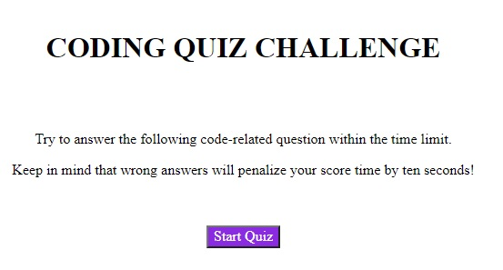
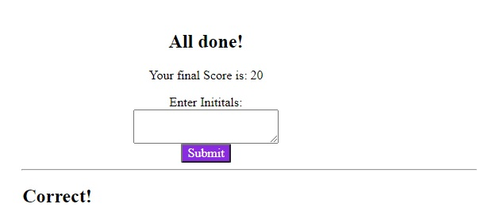

# code_quiz

Quiz based on javascript questions to evaluate your knowledge

Requirements
------------

No specific requirements.

This application was developed using HTML, CSS & Javascript.

Installation
------------

No installation needed.
This is a online quiz to have fun with.

Usage
------------
You can access the application by clicking on the following link:

https://rargotte.github.io/code_quiz/

The introduction screen will provide some details to start the quiz.

Once you press the start button all you need to do is to select the right answer by clicking on it.

At the end the appliation will provide your score and will ask for your initials. If you managed to beat the previous score you will be on the score board.

You can delete the score board or go back to start the same quiz again.

Here is the starting screen:

This is one of the questions of the quiz. Once you provide your answer the next screen will show the next question and the result of your answer.

Here the application shows your score and asks for your inititals.
Please provide and then select the go back button to re-start the quiz or "Clear Scores" to initialize the score board.

If you want to add more questions and answer is very easy:

1. In the script.js file add a new "quizx" object. Just copy the first one and change the number of the question. In this case we are adding question number 5:

var quiz5 = {
    question: "What is the name of this application?",
    answers: {
        answer1: "1. code_quiz",
        answer2: "2. quiz_code",
        answer3: "3. code_code"
    },

        correctAnswer: "b_1",

};

2. And then add the new object in the array of questions:

var quiz = [quiz1, quiz2, quiz3, quiz4, quiz5];

3. The new question should be displayed next time you run the application.

## License
Copyright (c) 11/06/2021 _Regulo Argotte_